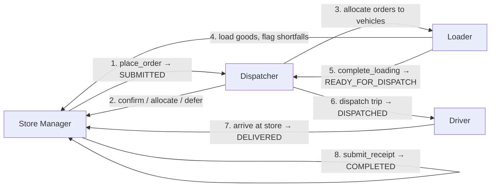
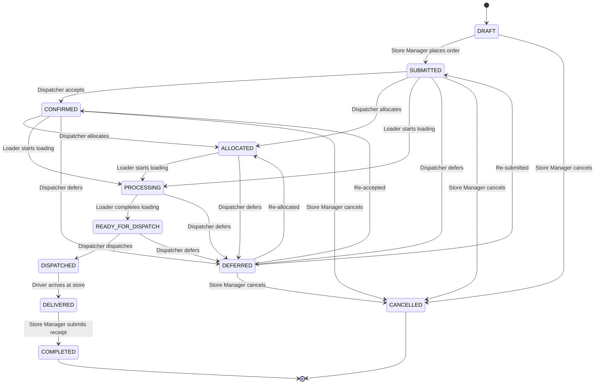

# Store Manager Integration Map

> Based on `store-manager-sudari` (commit `d9b36de`) + latest `origin/dev` (`6b43b96`).
> Your branch is 4 commits behind dev — merge or rebase before continuing.

---

## The Big Picture



---

## 1. Store Manager → Dispatcher

### What's Built

| Integration Point | Backend | Frontend | Status |
|---|---|---|---|
| **Place goods request** | [`order_service.place_order`](file:///c:/Users/ASUS/Desktop/SynapX_WaypointLogistics/backend/app/services/order_service.py#L123) → creates `SUBMITTED` orders | [`placeGoodsRequest`](file:///c:/Users/ASUS/Desktop/SynapX_WaypointLogistics/frontend/components/store/api/store-data.ts#L57) → `POST /orders/store` | ✅ Working |
| **Cancel before cutoff** | [`order_service.cancel_order`](file:///c:/Users/ASUS/Desktop/SynapX_WaypointLogistics/backend/app/services/order_service.py#L277) — only `DRAFT/SUBMITTED/CONFIRMED` | [`cancelStoreOrder`](file:///c:/Users/ASUS/Desktop/SynapX_WaypointLogistics/frontend/components/store/api/store-data.ts#L83) → `POST /orders/{id}/cancel` | ✅ Working |
| **Temperature-zone splitting** | One request → one `Order` per zone (Chilled / Ambient) | Frontend sends mixed items, backend splits | ✅ Working |
| **Operating day + cutoff validation** | [`calendar_service`](file:///c:/Users/ASUS/Desktop/SynapX_WaypointLogistics/backend/app/services/calendar_service.py) + [`order_rules`](file:///c:/Users/ASUS/Desktop/SynapX_WaypointLogistics/backend/app/services/order_rules.py) | Calendar picker fetches `/calendar/operating-days` | ✅ Working |
| **Fresh dual-order rule** | One chilled + one ambient per outlet per day for Fresh brands | Validated in `place_order` | ✅ Working |

### How the Dispatcher Consumes Store Manager Orders

The Dispatcher sees submitted orders in two ways:

1. **Direct query**: The existing [`/orders/`](file:///c:/Users/ASUS/Desktop/SynapX_WaypointLogistics/backend/app/api/v1/endpoints/orders.py) CRUD endpoint (Nisith's) lists all orders — the dispatcher filters by status `SUBMITTED`/`CONFIRMED`.
2. **Allocation flow**: The dispatcher allocates orders to vehicles via [`/allocations/`](file:///c:/Users/ASUS/Desktop/SynapX_WaypointLogistics/backend/app/api/v1/endpoints/allocations.py), setting `order.allocation_id`.

---

## 2. Dispatcher → Store Manager

### What's Built

| Integration Point | Backend | Frontend | Status |
|---|---|---|---|
| **Accept into plan** | Dispatcher calls `PATCH /orders/{id}/status` with `CONFIRMED` | Store Manager sees the status change + notification | ✅ Backend ready |
| **Defer an order** | [`order_service.defer_order`](file:///c:/Users/ASUS/Desktop/SynapX_WaypointLogistics/backend/app/services/order_service.py#L322) via `POST /orders/{id}/defer` | Sends `DEFERRED` notification with reason | ✅ Backend ready |
| **Notifications** | [`notification_service.send`](file:///c:/Users/ASUS/Desktop/SynapX_WaypointLogistics/backend/app/services/notification_service.py#L56) fires for `ORDER_CONFIRMED`, `DEFERRED` | [`getNotifications`](file:///c:/Users/ASUS/Desktop/SynapX_WaypointLogistics/frontend/components/store/api/store-data.ts#L88) reads them | ✅ Working |

### What Needs Integration

| Gap | What's Missing | Action Needed |
|---|---|---|
| **ETA updates** | `ETA_UPDATED` notification type exists in the model, but no one fires it yet | Dispatcher/Driver team needs to call `notification_service.send(..., ETA_UPDATED, {eta: "06:10"})` when the truck is approaching |
| **Dispatcher notes on partial loads** | `DISPATCHER_NOTE` notification type exists but the dispatcher UI doesn't send it | Dispatcher team wires their "Add Note" action to call `notification_service.send(..., DISPATCHER_NOTE, ...)` |

---

## 3. Store Manager ↔ Loader

### What's Built

| Integration Point | Backend | Frontend | Status |
|---|---|---|---|
| **Daily loading list** | Loader calls [`GET /orders/by-date?date=&depot=`](file:///c:/Users/ASUS/Desktop/SynapX_WaypointLogistics/backend/app/api/v1/endpoints/store_orders.py#L43) → [`order_service.get_orders_by_date`](file:///c:/Users/ASUS/Desktop/SynapX_WaypointLogistics/backend/app/services/order_service.py#L354) | Sachintha's Loader module consumes this | ✅ Ready |
| **Status update: PROCESSING** | Loader calls `PATCH /orders/{id}/status` with `PROCESSING` when loading starts | Store sees status move to "Being Prepared" | ✅ Backend ready |
| **Status update: READY_FOR_DISPATCH** | Loader calls `PATCH /orders/{id}/status` with `READY_FOR_DISPATCH` when loading completes | Fires `READY_FOR_DISPATCH` notification to store | ✅ Backend ready |
| **Shortfall display** | `dev` has shortfall notification display on request detail (commit `6b43b96`) | Request detail view shows loader shortfall notes | ✅ On dev |

> [!IMPORTANT]
> **Two loader systems exist in the codebase.** There's a mismatch you need to be aware of:
>
> 1. **Sachintha's `loader_service.py`** (101KB, [file](file:///c:/Users/ASUS/Desktop/SynapX_WaypointLogistics/backend/app/services/loader_service.py)) — the real loader with `DeliveryRun`, sign-in sessions, checklist, flag/release logic. Routes at `/api/v1/loader/*`. Uses **integer IDs** and talks to the real `order_service` directly.
>
> 2. **Your old `loading_service.py`** (5KB, [file](file:///c:/Users/ASUS/Desktop/SynapX_WaypointLogistics/backend/app/services/loading_service.py)) — the mock-based loading flow with UUID task IDs. Routes at `/api/loading/*`. **Already deleted on `store-manager` and `dev`**, but still exists on your branch.
>
> **Action**: After merging dev, the old `loading_service.py`, `loading.py` router, and `schemas/loading.py` will be gone. The frontend `services/api.ts` loading functions are also removed on dev.

### How the Real Loader Integrates

Sachintha's loader calls `order_service.update_order_status()` directly (same Python process, no HTTP call needed) to transition orders through `PROCESSING` → `READY_FOR_DISPATCH`. The contract endpoint `PATCH /orders/{id}/status` is there for when they run as separate services.

### Shortfall Flow (Contract §4)

```
Loader flags shortfall
  → loader_service sets order_items.quantity_sent (what was actually loaded)
  → loader_service writes order_items.dispatcher_note
  → calls notification_service.send(SHORTFALL_WARNING)
  → Store Manager Notifications screen shows it
  → Request Detail view shows "Sent: X / Ordered: Y" per item
```

### What Needs Integration

| Gap | What's Missing | Action Needed |
|---|---|---|
| **`quantity_sent` on order items** | The [`OrderItem`](file:///c:/Users/ASUS/Desktop/SynapX_WaypointLogistics/backend/app/models/order.py#L85) model has the column, but the Store Manager frontend doesn't yet display `quantity_sent` vs `quantity` on the receipt/delivery screens | Wire the request detail and delivery detail views to show `quantity_sent` from the API response |
| **Shortfall items in receipt form** | When submitting a receipt, pre-populate with `quantity_sent` so the store manager can compare what was loaded vs what arrived | Receipt page should fetch `order_items` with `quantity_sent` |

---

## 4. Store Manager ↔ Driver

### What's Built

| Integration Point | Backend | Frontend | Status |
|---|---|---|---|
| **Order status → DISPATCHED** | Dispatcher dispatches a trip → [`dispatch.py:create_run_from_allocation`](file:///c:/Users/ASUS/Desktop/SynapX_WaypointLogistics/backend/app/api/v1/endpoints/dispatch.py#L76) | No direct driver→store call for this step | ✅ Backend ready |
| **Arrival → DELIVERED** | Driver calls [`/driver/stops/{id}/arrive`](file:///c:/Users/ASUS/Desktop/SynapX_WaypointLogistics/backend/app/api/v1/endpoints/driver.py#L52) → stop status changes | `DELIVERED` notification fires to store | ⚠️ Partial (see below) |
| **Driver POD** | [`driver_service.submit_pod`](file:///c:/Users/ASUS/Desktop/SynapX_WaypointLogistics/backend/app/services/driver_service.py#L94) records signature + photo | Driver's own flow, store doesn't see this directly | ✅ Working independently |
| **Store receipt** | [`receipt_service.submit_receipt`](file:///c:/Users/ASUS/Desktop/SynapX_WaypointLogistics/backend/app/services/receipt_service.py#L13) | [`/store/receipt/[orderId]`](file:///c:/Users/ASUS/Desktop/SynapX_WaypointLogistics/frontend/app/store-manager/orders/%5BorderId%5D/receipt/page.tsx) and [`/store/deliveries/[orderId]`](file:///c:/Users/ASUS/Desktop/SynapX_WaypointLogistics/frontend/app/store/deliveries/%5BorderId%5D/page.tsx) | ✅ Working |
| **Offline receipt sync** | `POST /receipts/sync` for batch syncing | [`OfflineSyncBanner`](file:///c:/Users/ASUS/Desktop/SynapX_WaypointLogistics/frontend/components/OfflineSyncBanner.tsx) component | ✅ Working |

> [!WARNING]
> **The `receipt_service.py` still uses mocks.** On line 8, it imports from [`mocks.py`](file:///c:/Users/ASUS/Desktop/SynapX_WaypointLogistics/backend/app/services/mocks.py#L69):
> ```python
> from app.services.mocks import get_order_service, get_notification_service
> ```
> When `USE_MOCK_SERVICES=true` (the default), submitting a receipt:
> - Calls `MockOrderService.update_order_status()` which just **prints** instead of changing the DB
> - Calls `MockNotificationService.send()` which just **prints** instead of creating a notification
>
> **To integrate for real**: set `USE_MOCK_SERVICES=false`, or better yet, directly import and use the real services:
> ```python
> from app.services.order_service import order_service
> from app.services.notification_service import notification_service
> ```

### Driver → Store Manager Status Chain

The driver system (`driver_service.py`) manages its own `DriverTrip` / `DeliveryStop` models, separate from the order lifecycle. The missing link is:

| Gap | What's Missing | Action Needed |
|---|---|---|
| **Driver arrival doesn't update Order status** | `driver_service.record_arrival` only sets `DeliveryStop.status = ARRIVED`, it does NOT call `order_service.update_order_status(DELIVERED)` | The driver team or dispatcher needs to wire `DISPATCHED → DELIVERED` when the stop outcome is recorded |
| **No ETA push to store** | `ETA_UPDATED` notification type exists but nothing fires it | Driver/Dispatcher team sends ETA from `DispatchTrip.estimated_arrival` via `notification_service.send(ETA_UPDATED, {eta: ...})` |
| **Receipt → COMPLETED transition** | `receipt_service` calls mock `update_order_status("delivered")` but should call `update_order_status(COMPLETED)` | Fix the receipt service to call real `order_service.update_order_status(db, order_id, OrderStatus.COMPLETED)` |

---

## 5. Shared Data Infrastructure

### The `Order` Model — Single Source of Truth

Every module reads and writes the same [`orders`](file:///c:/Users/ASUS/Desktop/SynapX_WaypointLogistics/backend/app/models/order.py#L30) table:

| Column(s) | Written By | Read By |
|---|---|---|
| `order_number`, `status`, `outlet_id`, `brand`, `temperature_zone`, `operating_date`, `is_priority`, `notes`, `submitted_at`, `cutoff_at`, `placed_by`, `deferral_count` | Store Manager | All modules |
| `allocation_id` | Dispatcher | Loader, Driver |
| `deferral_reason` | Dispatcher (`defer_order`) | Store Manager |
| `weight_kg`, `units`, `volume_m3` | Store Manager (calculated) | Loader |
| `order_items.quantity_sent`, `order_items.dispatcher_note` | Loader | Store Manager |

### State Machine ([`TRANSITIONS`](file:///c:/Users/ASUS/Desktop/SynapX_WaypointLogistics/backend/app/services/order_service.py#L38))



### Notification Bus

All modules fire notifications to the Store Manager through a single service:

| Notification Type | Fired By | Category | When |
|---|---|---|---|
| `order_submitted` | Store Manager (`place_order`) | request | Order placed |
| `order_confirmed` | Dispatcher (`update_order_status → CONFIRMED`) | request | Accepted into plan |
| `dispatcher_note` | Loader/Dispatcher (not wired yet) | request | Partial allocation note |
| `shortfall_warning` | Loader (`flag_shortfall`) | request | Stock shortage at dock |
| `deferred` | Dispatcher (`defer_order`) | request | Postponed to another day |
| `ready_for_dispatch` | Loader (`update_order_status → READY_FOR_DISPATCH`) | request | All items packed |
| `eta_updated` | Driver/Dispatcher (not wired yet) | delivery | Truck approaching |
| `delivered` | Driver (`update_order_status → DELIVERED`) | delivery | Truck at dock |
| `issue_logged` | Store Manager receipt (not wired yet) | issue | Issue reported on delivery |
| `order_closed` | Receipt flow (`update_order_status → COMPLETED`) | request | Receipt submitted |

---

## 6. Summary: What Needs To Happen For Full Integration

### Immediate (your branch)

1. **Merge `origin/dev`** — you're 4 commits behind. This removes the old loading stubs and adds shortfall display.
2. **Replace mock imports in `receipt_service.py`** — switch from `get_order_service()` / `get_notification_service()` to direct imports of the real services.
3. **Fix receipt status transition** — change from `"delivered"` to `OrderStatus.COMPLETED`, since receipt submission is the final step.

### Needs Coordination With Other Teams

| Task | Who | How |
|---|---|---|
| Driver arrival → `DELIVERED` status on Order | Driver team (Minidu/Nagitha) | After `record_outcome(DELIVERED)`, call `PATCH /orders/{id}/status` with `DELIVERED` |
| ETA notification to store | Driver/Dispatcher team | Call `notification_service.send(ETA_UPDATED, ...)` when truck departs or GPS nears store |
| Dispatcher note notification | Dispatcher team (Nisith) | Call `notification_service.send(DISPATCHER_NOTE, ...)` from the dispatcher UI's "Add Note" |
| `quantity_sent` display | Your team (Store Manager) | Show `quantity_sent` vs `quantity` on delivery detail and receipt screens |
| Issues backend | Your team | Currently [`issues-store.ts`](file:///c:/Users/ASUS/Desktop/SynapX_WaypointLogistics/frontend/services/issues-store.ts) is localStorage-only mock data — needs a real backend table and API |
